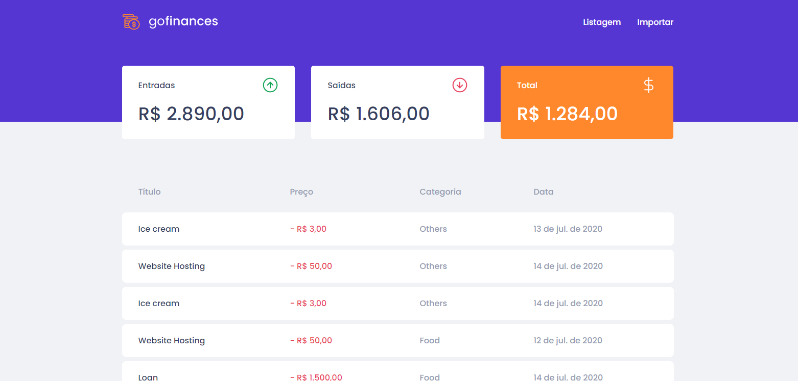

<h1 align="center">GOSTACK 11 DESAFIO 07 :zap:</h1>
<h1 align="center">Fundamentos do React.js :rocket:</h1>

## 💻 Sobre o projeto

#### Desafio 07: Fundamentos do React.js

<blockquote>
Essa é uma aplicação que irá se conectar ao seu backend do Desafio 06, e exibir as transações criadas e permitir a importação de um arquivo CSV para gerar novos registros no banco de dados.
</blockquote>

 ## 💻 Tecnologias

   - React.js
   - Typescript
   - Javascript

### Funcionalidades da aplicação

- **`Listar as transações da sua API`**: a página `Dashboard` exibe uma listagem através de uma tabela, com o campo `title`, `value`, `type` e `category` de todas as transações que estão cadastradas na sua API.

- **`Exibir o balance da sua API`**: Sua página `Dashboard`, exibe o balance que é retornado do seu backend, contendo o total geral, junto ao total de entradas e saídas.
- **`Importar arquivos CSV`**: Na  página `Import`, é possível o envio de um arquivo no formato `csv` para o seu backend, que irá fazer a importação das transações para o seu banco de dados.

## :memo: Licença

Esse projeto está sob a licença MIT. 
Veja o arquivo [LICENSE](.github/LICENSE.md) para mais detalhes.